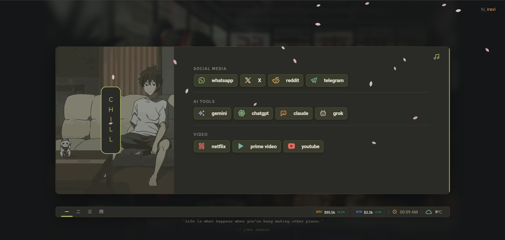
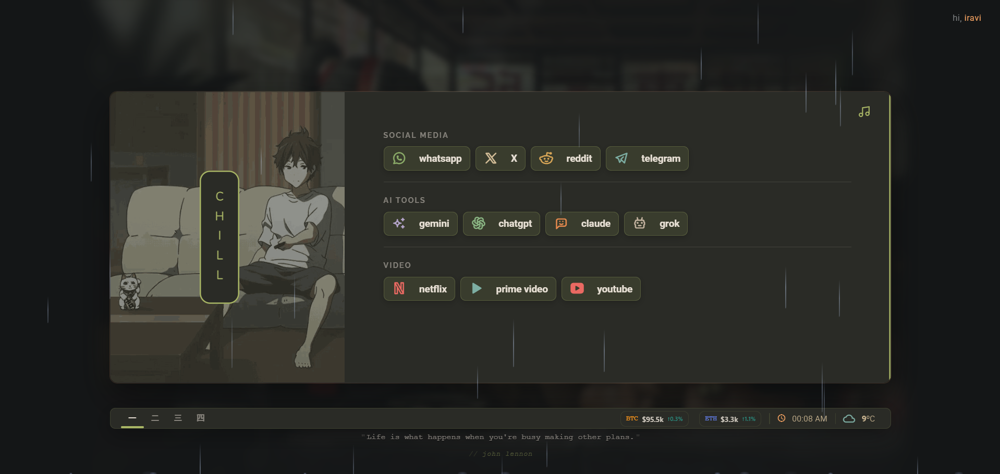

<!-- 
     ██╗  ██╗ ██████╗ ███╗   ███╗ ██████╗ ██████╗ ███████╗██████╗ ██╗
     ██║ ██╔╝██╔═══██╗████╗ ████║██╔═══██╗██╔══██╗██╔════╝██╔══██╗██║
     █████╔╝ ██║   ██║██╔████╔██║██║   ██║██████╔╝█████╗  ██████╔╝██║
     ██╔═██╗ ██║   ██║██║╚██╔╝██║██║   ██║██╔══██╗██╔══╝  ██╔══██╗██║
     ██║  ██╗╚██████╔╝██║ ╚═╝ ██║╚██████╔╝██║  ██║███████╗██████╔╝██║
     ╚═╝  ╚═╝ ╚═════╝ ╚═╝     ╚═╝ ╚═════╝ ╚═╝  ╚═╝╚══════╝╚═════╝ ╚═╝
-->

<div align="center">

<br>


<br><br>

# ˗ˏˋ 木漏れ日 ˎˊ˗

**your cozy corner of the internet**

<br>

<a href="https://readme-typing-svg.demolab.com/demo/">
  
</a>

<br><br>

<!-- Quick Links -->
[**🌸 Try Demo**](https://cookedzera.github.io/komorebi-startpage/) ·
[**📦 Download**](https://github.com/cookedzera/komorebi-startpage/releases/latest) ·
[**⭐ Star**](https://github.com/cookedzera/komorebi-startpage)

<br>

</div>

---

### ☕ what's this?

> **komorebi** *(木漏れ日)* — japanese for *"sunlight filtering through leaves"*

a browser startpage for late night coders, students, and anyone who wants their new tab to feel like *home*.

<br>

### ✨ features

| | |
|:---|:---|
| 🌧️ **ambient sounds** | rain, sparkle, vibes |
| 🎨 **glassmorphism** | frosted panels, soft shadows |
| 🖼️ **custom banners** | 12+ lofi animated backgrounds |
| ⚡ **zero bloat** | no frameworks, just vibes |
| 🌙 **dark mode** | easy on the eyes at 3am |

<br>

---

### 📸 gallery

<div align="center">

| cozy rain ☔ | late night ✨ |
|:---:|:---:|
|  |  |

</div>

<br>

---

### 🎮 controls

```
┌─────────────────────────────────────────┐
│  [s]        →  search                   │
│  [1-4]      →  switch tabs              │
│  [⌘ + K]   →  command palette (beta)    │
│  triple-tap →  open settings            │
└─────────────────────────────────────────┘
```

<br>

---

### 🖼️ banners

<div align="center">

*pick your vibe*

| | | | |
|:-:|:-:|:-:|:-:|
|||||
|||||

</div>

<br>

---

### 🚀 install

<details>
<summary><b>Chrome / Edge</b></summary>

```bash
# 1. download from releases
# 2. extract the zip
# 3. go to chrome://extensions
# 4. enable "Developer mode"
# 5. click "Load unpacked" → select folder
# 6. open new tab ✨
```

</details>

<details>
<summary><b>Firefox / LibreWolf</b></summary>

```bash
# 1. rename manifest.firefox.json → manifest.json
# 2. go to about:debugging
# 3. click "Load Temporary Add-on"
# 4. select the manifest file
```

> **💡 New Tab not working?**  
> Firefox blocks new tab overrides by default. Use one of these:
> - Install **[New Tab Override](https://addons.mozilla.org/en-US/firefox/addon/new-tab-override/)** extension
> - Set as **homepage** instead (works perfectly!)
> - Or just bookmark `index.html` ☺️

</details>

<details>
<summary><b>Just open in browser</b></summary>

```bash
# double-click index.html
# that's it 🎉
```

</details>

<br>

---

### 🎨 make it yours

edit `userconfig.js`:

```js
// add your quotes
customQuotes: [
  { text: "stay cozy.", author: "you" }
],

// add your links with custom icons
bookmarks: [
  { name: "GitHub", url: "https://github.com", icon: "brand-github" }
]
```

> **🎨 Want custom icons?**  
> Browse **[Tabler Icons](https://tabler-icons.io/)** and use any icon name!  
> Example: `icon: "brand-spotify"`, `icon: "heart"`, `icon: "coffee"`

<br>

---

<div align="center">

### 💚

made with insomnia & good vibes

<br>

*forked from [AllJavi/tartarus-startpage](https://github.com/AllJavi/tartarus-startpage)*

<br>

<sub>if you like it, leave a ⭐</sub>

<br><br>


</div>
